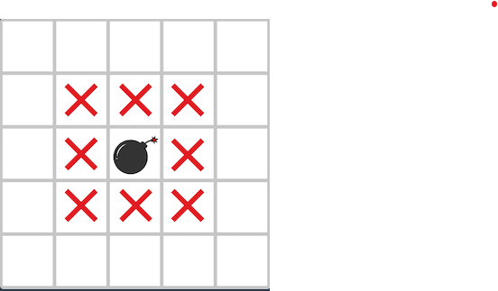

# 안전지대
https://school.programmers.co.kr/learn/courses/30/lessons/120866

## 문제 설명
다음 그림과 같이 지뢰가 있는 지역과 지뢰에 인접한 위, 아래, 좌, 우, 대각선 칸을 모두 위험지역으로 분류합니다.   
   
지뢰는 2차원 배열 `board`에 1로 표시되어 있고 `board`에는 지뢰가 매설 된 지역 1과, 지뢰가 없는 지역 0만 존재합니다.   
지뢰가 매설된 지역의 지도 `board`가 매개변수로 주어질 때, 안전한 지역의 칸 수를 return하도록 solution 함수를 완성해주세요.

- 제한 사항
  - `board`는 n * n 배열입니다.
  - 1 ≤ n ≤ 100
  - 지뢰는 1로 표시되어 있습니다.
  - `board`에는 지뢰가 있는 지역 1과 지뢰가 없는 지역 0만 존재합니다.
- 입출력 예
  - |board|result|
    |---|---|
    |[[0, 0, 0, 0, 0], [0, 0, 0, 0, 0], [0, 0, 0, 0, 0], [0, 0, 1, 0, 0], [0, 0, 0, 0, 0]]|16|
    |[[0, 0, 0, 0, 0], [0, 0, 0, 0, 0], [0, 0, 0, 0, 0], [0, 0, 1, 1, 0], [0, 0, 0, 0, 0]]|13|
    |[[1, 1, 1, 1, 1, 1], [1, 1, 1, 1, 1, 1], [1, 1, 1, 1, 1, 1], [1, 1, 1, 1, 1, 1], [1, 1, 1, 1, 1, 1], [1, 1, 1, 1, 1, 1]]|0|

## Solution. 0
```python
def solution(board):
    # 지뢰 주변 위험지대 탐색할 좌표값 입력
    x = [-1, 0, +1]
    y = [-1, 0, +1]

    # 지뢰가 매설된 지역(1) 찾기
    for i in range(len(board)):
        for j in range(len(board[i])):
            if board[i][j] == 1:
                for a in x:
                    for b in y:
                        # 주어진 x,y 좌표값을 활용해 지뢰와 지뢰주변 위험지역 2로 변경
                        # board의 가장자리부분의 list out of range의 오류 해결 위해 예외처리
                        try:
                            if board[i+a][j+b] == 1:
                                continue    
                            else:
                                board[i+a][j+b] = 2
                        except:
                            continue

    # 안전지대(0)인 개수를 찾아 return             
    answer = 0                
    for x in board:
        for y in x:
            if y == 0:
                answer += 1
                          
    return answer
```
### Sol. 0 - 결과
> **90/100 점** (test case 1개 fail)

## Solution. 1 
- board 가장자리에서의 위험지역 할당 시, 오류를 해결하기 위해 board의 맨 위, 아래, 양 옆 칸 추가

```python
def solution(board):
    # board 각 배열 당, 양 옆 인덱스에 값 추가 
    for i in range(len(board)):
        board[i].insert(0, 2)
        board[i].append(2)

    # board 맨 위, 맨 아래에 추가할 list 생성 
    lst = [2 for _ in range(len(board[0]))]

    # board 맨 위, 맨 아래에 lst 추가
    board.insert(0, lst)
    board.append(lst)

    # 위험지대 탐색할 좌표값 입력
    x = [-1, 0, +1]
    y = [-1, 0, +1]

    # 지뢰가 매설된 지역(1) 찾기
    for i in range(len(board)):
        for j in range(len(board[i])):
            if board[i][j] == 1:
                for a in x:
                    for b in y:
                        # 주어진 x,y 좌표값을 활용해 지뢰와 지뢰주변 위험지역 2로 변경
                        # 매설된 지역과 위험지역을 2로 변경해 비 위험지역과 구분
                        if board[i+a][j+b] == 1:
                            continue    
                        else:
                            board[i+a][j+b] = 2

    # 안전지대(0)인 개수를 찾아 return             
    answer = 0                
    for x in board:
        for y in x:
            if y == 0:
                answer += 1
                       
            
    return answer
```

### Sol. 1 - 결과
> **100/100 점** (test case 0개 fail)