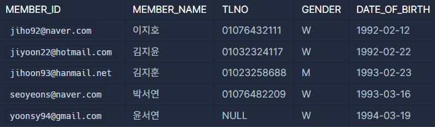
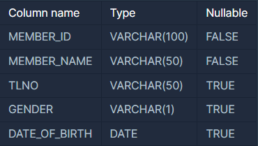

# 3월에 태어난 여성 회원 목록 출력하기
https://school.programmers.co.kr/learn/courses/30/lessons/131120

## 문제 설명
`MEMBER_PROFILE` 테이블에서 생일이 3월인 여성 회원의 ID, 이름, 성별, 생년월일을 조회하는 SQL문을 작성해주세요. 이때 전화번호가 NULL인 경우는 출력대상에서 제외시켜 주시고, 결과는 회원ID를 기준으로 오름차순 정렬해주세요.

- `MEMBER_PROFILE TABLE`   
     

- `TABLE SCHEMA`   
  

SQL을 실행하면 다음과 같이 출력되어야 합니다.

|MEMBER_ID|MEMBER_NAME|GENDER|DATE_OF_BIRTH|
|---|---|---|---|
|seoyeons@naver.com|박서연|W|1993-03-16|

> 주의사항   
- `DATE_OF_BIRTH`의 데이트 포맷이 예시와 동일해야 정답처리 됩니다.

## Solution. 0
```sql
-- 코드를 입력하세요
-- DATE_FORMAT 함수를 이용해 원하는 결과값에 맞게 포맷팅
SELECT MEMBER_ID, MEMBER_NAME, GENDER, DATE_FORMAT(DATE_OF_BIRTH, '%Y-%m-%d')
FROM MEMBER_PROFILE

-- 제약사항에 맞게 WHERE절 구성
-- 생일이 3월인 여성 회원의 member_id, member_name, gender, date_of_birth를 작성
-- 전화번호가 null이면 제외
WHERE MONTH(DATE_OF_BIRTH) = 3 AND TLNO IS NOT NULL AND GENDER = 'W'

-- MEMBER_ID를 기준 오름차순 정렬
ORDER BY MEMBER_ID ASC;
```

### Sol. 0 - 결과
> **100/100 점** 