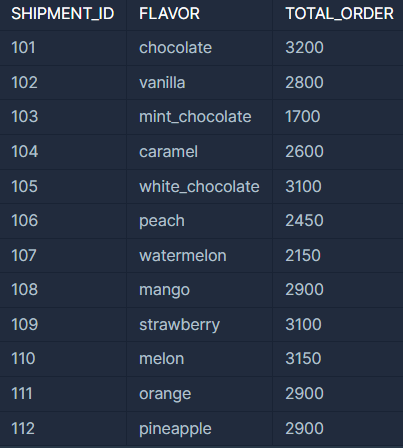
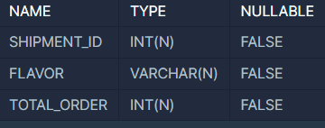
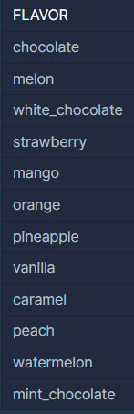

# 인기있는 아이스크림
https://school.programmers.co.kr/learn/courses/30/parts/17042

## 문제 설명
판매된 아이스크림의 맛을 총주문량을 기준으로 내림차순 정렬하고 총주문량이 같다면 출하 번호를 기준으로 오름차순 정렬하여 조회하는 SQL 문을 작성해주세요.

- `FIRST_HALF TABLE`   
  

- `TABLE SCHEMA`   
  

- 출력 결과   
  

## Solution. 0
```sql
-- 코드를 입력하세요
SELECT FLAVOR -- FLAVOR 컬럼만 select
FROM FIRST_HALF
-- TOTAL_ORDER가 같을 경우, SHIPMENT_ID를 기준으로 오름차순 정렬
ORDER BY TOTAL_ORDER DESC, SHIPMENT_ID ASC;  
```

### Sol. 0 - 결과
> **100/100 점** 